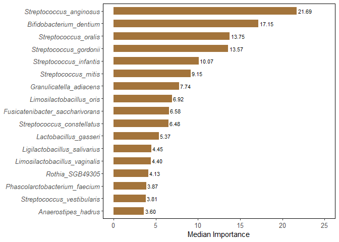
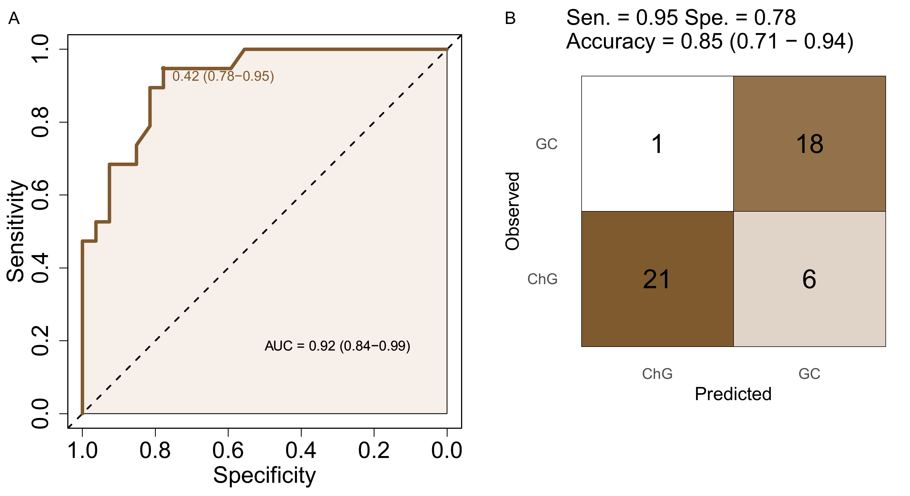
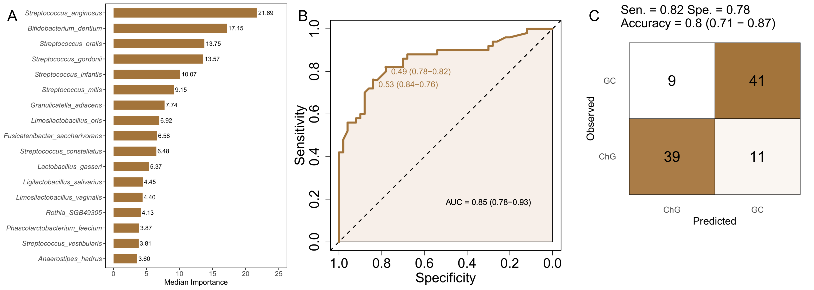

# 🦠 Microbiome Machine Learning Biomarker Pipeline
**基于宏基因组特征的微生态标志物筛选与机器学习预测流程**

[](https://www.r-project.org/)
[](https://opensource.org/licenses/MIT)
[]()

本项目提供了一套完整的、端到端 (End-to-End) 的生信机器学习分析流程。专为高维、稀疏的微生态宏基因组（或 16S）丰度数据设计，旨在通过极其严苛的降维算法锁定核心标志菌，并构建具有高度泛化能力的临床疾病分类模型。

本代码库再现了从特征提纯、多模型交叉验证、外部独立队列测试到全自动科研级拼图的完整过程。
---

## ✨ 核心特性 (Key Features)

* **🛡️ 极致的降维策略 (Ultra-strict Feature Selection)**
  集成 `Boruta` 算法，在 200 次影子特征置换检验的基础上，引入严苛的 Bonferroni 多重比较校正 ($p<0.001$)，从底层逻辑上锁死高维微生物数据的过拟合风险，精准锁定 **Confirmed** 核心标志物。
* **⚔️ 多模型交叉评估 (Model Benchmarking)**
  基于 `caret` 框架，在训练集内部执行严格的 10 折交叉验证 (10-fold CV)，横向评估并比较 6 大经典算法 (Random Forest, SVM-Linear, GLM, LDA, Neural Network, KKNN) 的效能，并提供 DeLong 检验统计结果。
* **🌍 外部独立验证 (External Validation)**
  原生支持双队列架构，利用独立的测试队列（如异地验证集）评估模型的真实临床泛化能力，并基于约登指数 (Youden's J statistic) 动态获取最佳预测截断值。
* **🎨 自动化科研绘图 (Automated Visualization)**
  利用 `magick` 引擎实现 R 语言环境内的 PDF 矢量图无缝拼接与自动化排版打标，告别手动拼图。

---

## 🔍 分析流程详解 (Workflow Details)

本流程严格遵循高标准生信分析规范，主要分为以下五个核心阶段：

### 1. 数据预处理与队列对齐 (Data Wrangle)
* **特征初筛**：导入前期 MWAS (Metagenome-Wide Association Study) 的差异分析结果，初步锁定显著差异物种。
* **跨队列对齐**：自动提取发现集 (Cohort 1) 与验证集 (Cohort 2) 的共有物种交集，确保模型具有跨人群的可迁移性。
* **CLR 转化**：对丰度矩阵进行中心对数比 (CLR) 转换，消除成分数据 (Compositional Data) 的偏差。

### 2. 启发式特征提纯 (Boruta Feature Selection)
* **影子特征置换**：通过构建随机打乱的影子变量 (Shadow Features)，评估原始特征的真实显著性。
* **严苛过滤**：代码中设置 `pValue = 0.001`。这是一种极其严苛的筛选门槛，旨在排除所有潜在的噪音噪声，仅保留在统计学上绝对可靠的 **Confirmed** 特征作为建模输入。

### 3. 多算法建模与评估 (Model Benchmarking)
* **10 折交叉验证**：在训练集中将样本分为 10 份循环训练，避免由于单次划分导致的模型偏见。
* **多算法并行**：同时调用随机森林 (RF)、支持向量机 (SVM)、逻辑回归 (GLM) 等 6 种经典算法，并通过 DeLong 检验评估各模型 ROC 曲线下的面积 (AUC) 是否存在显著性差异。

### 4. 动态阈值与分类评估 (Dynamic Threshold & CM)
* **约登指数优化**：模型不简单地使用 0.5 作为分类阈值，而是根据 ROC 曲线自动寻找约登指数 (Youden's J) 最大的点作为最佳截断值。
* **多维评估**：输出敏感度 (Sen.)、特异度 (Spe.) 和准确率 (Acc.) 以及 95% 置信区间。

### 5. 外部验证与全自动拼图 (Validation & Assembly)
* **独立队列验证**：将训练好的模型直接应用于完全独立的外部验证集，评估其临床实战效能。
* **自动化出版级排版**：利用图像处理引擎 `magick`，自动将生成的多个矢量 PDF 图像按论文发表要求进行尺寸调整、标签标注 (A/B/C) 和拼接，生成最终的成果图。

---

## 📂 仓库目录结构 (Repository Structure)

```text
├── data/                                 # 存放示例丰度表与临床分组数据 (Toy Dataset)
│   ├── MWAS_stool_species_res.tsv        # 预筛选候选特征集
│   ├── Cohort1_stool_dt.tsv              # 发现集 (Discovery Cohort) 丰度矩阵
│   └── Cohort2_stool_dt.tsv              # 验证集 (Validation Cohort) 丰度矩阵
├── output/                               # 自动化结果输出目录 (代码运行后自动生成)
│   ├── boruta_imp_stool.csv              # Boruta 特征重要性统计表
│   ├── top_stool_validationHEB.pdf       # 最终拼接的矢量级科研图片
│   └── ...                               # 各类独立的 ROC 曲线与混淆矩阵 PDF
├── stool_n28_confirmed_files/figure-gfm/ # Rmd 自动提取的网页预览图目录
├── stool_n28_confirmed.Rmd               # 🌟 核心分析源码 (可直接交互运行)
└── README.md                             # 本说明文档
```

---

## 🚀 快速开始 (Quick Start)
### 0. 请在运行代码前，先解压 data.zip 文件 (Please extract data.zip before running).

### 1. 环境依赖 (Dependencies)
请确保您的 R 环境安装了以下核心依赖包：

```R
install.packages(c("Boruta", "caret", "randomForest", "pROC", "magick", "data.table", "dplyr", "ggplot2","pdftools"))
```

### 2. 运行分析 (Run)
1. 克隆本项目到本地：
```bash
git clone [https://github.com/newvibe-GIF/GC-Microbiome-Biomarkers.git](https://github.com/newvibe-GIF/GC-Microbiome-Biomarkers.git)
```
2. 在 RStudio 中打开 `stool_n28_confirmed.Rmd`。
3. 点击 RStudio 上方的 **Knit** (选择 Knit to github_document) 即可一键生成全套结果。
4. 运行结束后，所有高清 PDF 图表将自动保存在 output/ 文件夹中。

---

## 📊 预期结果预览 (Output Preview)

> **注意：** 如果下方图片无法显示，请确保您已将 `stool_n28_confirmed_files` 整个文件夹上传到仓库。

### 1. 核心标志物重要性评估 (Boruta Feature Selection)
算法基于 Z-score 对所有 Confirmed 标志物进行排序，彻底剔除了冗余噪音。



### 2. 独立队列验证效能 (External Validation)
在未参与训练的外部队列中，模型展现出稳健的预测效能 (AUC)。



### 3. 最终组合成果图 (Final Assembly)



---

## ✒️ 引用 (Citation)
该项目源于深圳华大基因股份有限公司刘莉萍、覃友文老师的研究工作,如果您在研究中使用了本套分析代码或思路，请引用我们的研究工作：
[ Distinct signatures in the human gut and oral microbiomes of gastric cancer] > Qin Y., Zhang Y., Liu L., et al. Cell Reports Medicine (2026).
DOI: [https://doi.org/10.1016/j.xcrm.2026.102761]

数据中MWAS_stool_species_res.tsv的全宏基因组关联分析结果可参考https://github.com/Owen-haha/GC_OralGut_MWAS

## 📜 许可协议 (License)
本项目基于 MIT License 开源，欢迎自由学习、修改与分发。
